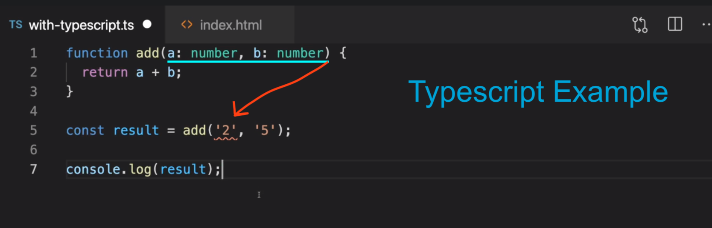
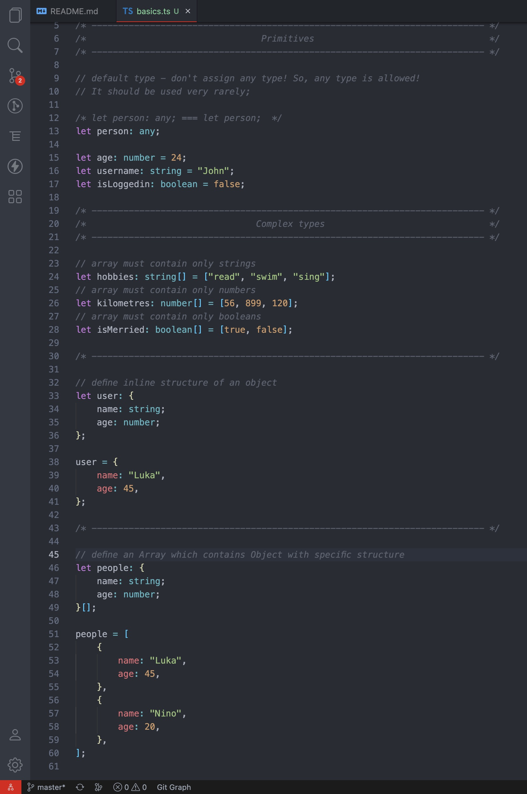
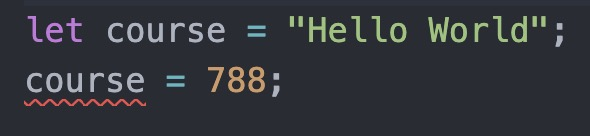
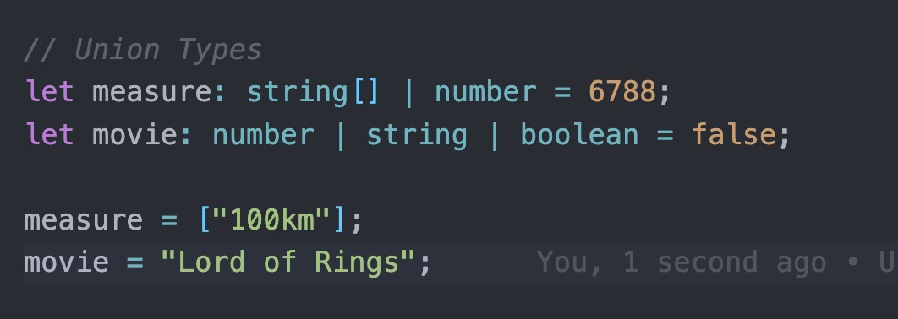
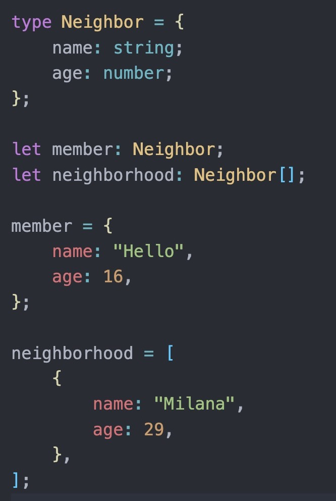

# Typescript-with-React-fundamentals

## Typescript Fundamentals

Typescript is "superset" to JS. It is programming language which builds up on JS & it extends JS. It is not Library - Typescript just adds more features to the JS. Most importantly, it adds static typing to JS.

Because JS is dynamically typed, so it does not expects any particular type in data, it does not have by default STATIC typed data. It just takes whatever it gets & then tries to execute this code. **And this dynamic typing causes errors quite often. So, Typescript with static typing could enhance your code & prevent errors.**

-   TypeScript adds additional syntax to JavaScript to support a tighter integration with your editor. Catch errors early in your editor.
-   TypeScript understands JavaScript and uses type inference to give you great tooling without additional code.

---

## Installation

-   install Typescript in **standart web (HTML)** application:
    ⓵ `npm install typescript` ===> ⓶`npx tsc filename`

---

## Working with Primitives, Array & Object Types

---

## Type Inference

`Type inference is used to provide type information when there is no explicit type annotation.`
If you immediately initialize variable without type, typescript will look at the value type here - so, it will see that we stored a string in that variable. And it will then use that value type as an inferred type for this variable. And if you then try to assign a different type thereafter, you will get an error because of type inference;

---

## Union Types

A union type allows you to provide more then one type for single variable.

---

## Type Aliases

Aliases and Interfaces allows types to be easily shared between different variables/objects.
Interfaces are similar to type aliases, except they **only apply to object types**.
Type aliases are difing with keyword `type`.

