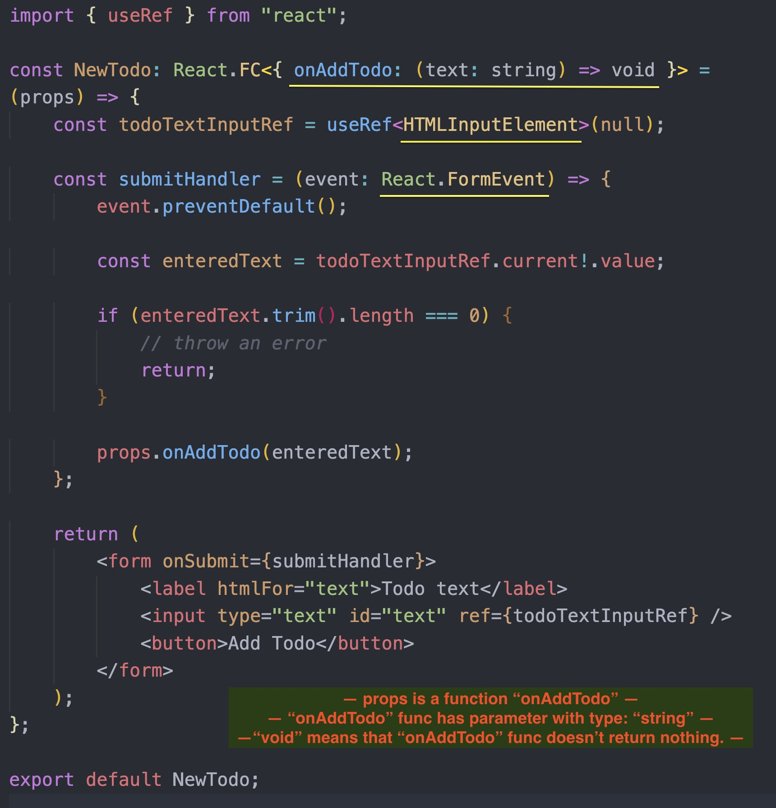

# Typescript-with-React-fundamentals

## Typescript Fundamentals

Typescript is "superset" to JS. It is programming language which builds up on JS & it extends JS. It is not Library - Typescript just adds more features to the JS. Most importantly, it adds static typing to JS.

Because JS is dynamically typed, so it does not expects any particular type in data, it does not have by default STATIC typed data. It just takes whatever it gets & then tries to execute this code. **And this dynamic typing causes errors quite often. So, Typescript with static typing could enhance your code & prevent errors.**

-   TypeScript adds additional syntax to JavaScript to support a tighter integration with your editor. Catch errors early in your editor.
-   TypeScript understands JavaScript and uses type inference to give you great tooling without additional code.

---

## Installation

-   install Typescript in **standart web (HTML)** application:
    ⓵ `npm install typescript` ===> ⓶`npx tsc filename`

-   install Typescript for **React** project:
    `npx create-react-app my-app --template typescript`

-   install TypeScript to an **existing React App** project, first install it:
    `npm install --save typescript @types/node @types/react @types/react-dom @types/jest`

---

## Working with Primitives, Array & Object Types

---

## Type Inference

`Type inference is used to provide type information when there is no explicit type annotation.`
If you immediately initialize variable without type, typescript will look at the value type here - so, it will see that we stored a string in that variable. And it will then use that value type as an inferred type for this variable. And if you then try to assign a different type thereafter, you will get an error because of type inference.

---

## Union Types

A union type allows you to provide more then one type for single variable.

---

## Type Aliases

Aliases and Interfaces allows types to be easily shared between different variables/objects.
Interfaces are similar to type aliases, except they **only apply to object types**.
Type aliases are difing with keyword `type`.

---

## Function Types

---

## Generics

Generics allow creating 'type variables' that don't need to explicitly define the types that they use.
Generics makes it easier to write reusable code.
Generics with functions help make more generalized methods which more accurately represent the types used and returned.

While using any is certainly generic in that it will cause the function to accept `any` and all types for the type of arg, we actually are losing the information about what that type was when the function returns. If we passed in a number, the only information we have is that any type could be returned.

Instead, we need a way of capturing the type of the argument in such a way that we can also use it to denote what is being returned. Here, we will use a type variable, a special kind of variable that works on types rather than values.

**We’ve now added a type variable `Type` to the identity function. This `Type` allows us to capture the type the user provides (e.g. number), so that we can use that information later. Here, we use Type again as the return type. On inspection, we can now see the same type is used for the argument and the return type. This allows us to traffic that type information in one side of the function and out the other.**

We say that this version of the identity function is generic, as it works over a range of types. Unlike using any, it’s also just as precise (i.e., it doesn’t lose any information) as the first identity function that used numbers for the argument and return type.

---

## What is **React.FC** (React.FunctionalComponent) as a type definition?

It makes it clear that component is a function that acts as a functional component. This is how Typescript realizes that it is a React component and not a regular JavaScript function.

`You use angle brackets <> & between those angle brackets you define your own props (if your component gets some custom props)`

---

## React.FormEvent

It is a special type provided by React package, which is for Form Events type declaring in React.

## HTMLInputElement

The gist of it is that typescript has no way of knowing that the element is an HTMLInputElement rather than a generic HTMLElement unless you tell it so.

---
